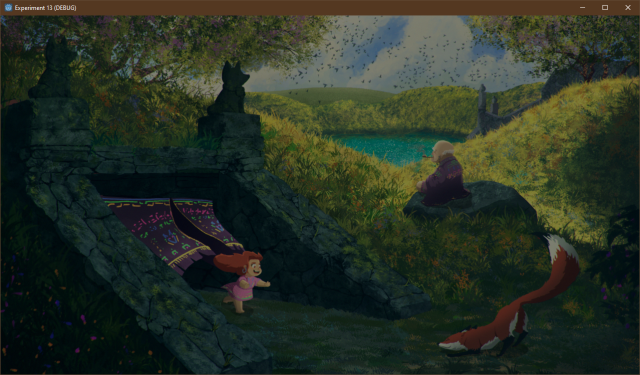

# Godot Experiments

Some experiments using the [Godot](https://godotengine.org/) game engine.

These are ports of my
[PyGame experiments](https://github.com/Taffer/pygame-experiments/) (which
started as ports of my
[Löve experiments](https://github.com/Taffer/love-experiments/) for now), we'll
see where this goes.

* [Experiment 01 - Scrolling Texture](#experiment01)
* [Experiment 02 - Monospaced Text](#experiment02)
* [Experiment 03 - Variable Text](#experiment03)
* [Experiment 04 - Text Entry](#experiment04)
* [Experiment 05 - Image Fade](#experiment05)
* [Experiment 06 - UI Dialog](#experiment06)
* [Experiment 07 - Animiated Icon](#experiment07)
* [Experiment 08 - Styled Text](#experiment08)
* [Experiment 09 - UI Button](#experiment09)
* [Experiment 10 - UI Spinbox](#experiment10)
* [Experiment 11 - Tilemap](#experiment11)
* [Experiment 12 - Tilemap Minimap](#experiment12)
* [Experiment 13 - Fade](#experiment13)
* [Experiment 14 - Animated Sprite](#experiment14)
* [Experiment 15 - Drop shadow text](#experiment15)
* [Experiment 16 - Joystick](#experiment16)
* [Experiment 17 - Sprite Joystick](#experiment17)
* [Experiment 18 - Tilemap Layers](#experiment18)
* [Experiment 19 - Lighting](#experiment19)
* [Experiment 20 - LPC Sprite](#experiment20)

## Bribe me

Want to bribe me to work on more experiments, faster? Want to suggest an
experiment?

Always willing to entertain suggestions, but if you're asking me to do some
work, you have the option of fuelling it with coffee. ;-)

## Credits

These use the [Godot Engine](https://godotengine.org/).

## License

Stuff I wrote is released under the [MIT license](LICENSE.md), and any
resources are covered by their respective licenses (please see individual
experiment write up for details). I'm only using open source and freely usable
third-party bits, but they might not be using MIT's license.

## <a name="experiment01">Experiment 01 - Scrolling Texture</a>

Old games used a technique to animate textures where they shifted the sprite one
row or column per frame. An easy/cheesy way to do this is to just produce a set
of sprites that are shifted already and treat them as individual frames.

I want to see if there's a way to do it without duplicating and modifying the
sprite. I'm thinking that ancient platforms (think Commodore C=64 or Apple ][)
wouldn't have the memory to waste for this sort of thing.

The goal is to do this with one draw call, by adjusting the texture.

This is actually more complex in Godot than in PyGame or Löve2D; we have to
write a shader! Thank you Internet for answering this question.

### Graphics

* `character_robot_jump.png` - From Kenney.nl's freely usable
  [Toon Characters 1](https://kenney.nl/assets/toon-characters-1) collection.

## <a name="experiment02">Experiment 2 - Monospaced Text</a>

This is an attempt to create a simple text/console type of window. Print text
to it, render it, and scroll up when you reach the bottom. Think of the
text area in the bottom-right of the
[Ultima V](https://wiki.ultimacodex.com/wiki/File:U5amig.jpg), for example.

We'll make an area that can display five lines of 20 characters each. It
automatically wraps lines that are too long, and there's a rectangle around
the text area so you can be sure it's not over-drawing.

### Graphics

* `LiberationMono-Bold.ttf` - An open source font from the
  [liberationfonts](https://github.com/liberationfonts/liberation-fonts) repo;
  this is licensed under the
  [SIL Open Font License](https://github.com/liberationfonts/liberation-fonts/blob/master/LICENSE).

## <a name="experiment03">Experiment 3 - Variable Width Text</a>

This is the same as [Experiment 2](#experiment02), but with a variable-width
font. This is trivial in Godot.

### Graphics

* `LiberationSerif-Bold.ttf` - An open source font from the
  [liberationfonts](https://github.com/liberationfonts/liberation-fonts) repo;
  this is licensed under the
  [SIL Open Font License](https://github.com/liberationfonts/liberation-fonts/blob/master/LICENSE).

## <a name="experiment04">Experiment 4 - Text Entry</a>

This is an attempt to turn Experiment 2 into a simple text entry box. Whatever
you type will be printed in the text area.

We'll make an area that can display five lines of 20 characters each. There's a
rectangle around the text area so you can be sure it's not over-drawing.

This is trivial with Godot, just use a `TextEntry` object.

### Graphics

* `LiberationMono-Bold.ttf` - An open source font from the
  [liberationfonts](https://github.com/liberationfonts/liberation-fonts) repo;
  this is licensed under the
  [SIL Open Font License](https://github.com/liberationfonts/liberation-fonts/blob/master/LICENSE).

## <a name="experiment05">Experiment 5 - Image Fade</a>

In this experiment, we'll fade an image from black to fully-drawn.

### Graphics

* `character_robot_jump.png` - From Kenney.nl's freely usable
  [Toon Characters 1](https://kenney.nl/assets/toon-characters-1) collection.

## <a name="experiment06">Experiment 6 - UI Dialog</a>

In this experiment, we'll draw a dialog box with some text in it and a
character portrait.

### Graphics

* `HONK.png` - The Goose from House House's amazing
  [Untitled Goose Game](https://goose.game/), used without permission. I'm not
  affiliated with House House in any way, other than as a happy customer. You
  should buy Untitled Goose Game, it's *amazingly fun*. I have it on my Switch!
* `rpg_gui_v1` -
  [RPG GUI construction kit v1.0](https://opengameart.org/content/rpg-gui-construction-kit-v10)
  by Lamoot on OpenGameArt.org. I had to create a 9-patch image of the parts I
  wanted to use because I couldn't figure out how to use arbitrary texture
  hunks for it in Godot.

Font:

* `LiberationSerif-Bold.ttf` - An open source font from the
  [liberationfonts](https://github.com/liberationfonts/liberation-fonts) repo;
  this is licensed under the
  [SIL Open Font License](https://github.com/liberationfonts/liberation-fonts/blob/master/LICENSE).

## <a name="experiment07">Experiment 7 - Animated Icon</a>

In this experiment, we'll draw an animated icon.

This is trivial in Godot thanks to the `AnimiatedSprite` object.

### Graphics

* `character_robot_sheet.png` - From Kenney.nl's freely usable
  [Toon Characters 1](https://kenney.nl/assets/toon-characters-1) collection.

## <a name="experiment08">Experiment 8 - Styled Text</a>

This is an attempt to create a simple text window that supports some text
styling (multiple fonts and colours). Print text to it, render it, and scroll
up when you reach the bottom.

### Graphics

* `LiberationMono-Bold.ttf` and `LiberationSerif-Bold.ttf` - Open source fonts
  from the
  [liberationfonts](https://github.com/liberationfonts/liberation-fonts) repo;
  this is licensed under the
  [SIL Open Font License](https://github.com/liberationfonts/liberation-fonts/blob/master/LICENSE).

## <a name="experiment09">Experiment 9 - UI Button</a>

In this experiment, we'll draw a button with some text in it. It'll respond
to the mouse hovering over it, and clicks.

### Graphics

* `rpg_gui_v1` -
  [RPG GUI construction kit v1.0](https://opengameart.org/content/rpg-gui-construction-kit-v10)
  by Lamoot on OpenGameArt.org.

Font:

* `LiberationSerif-Bold.ttf` - An open source font from the
  [liberationfonts](https://github.com/liberationfonts/liberation-fonts) repo;
  this is licensed under the
  [SIL Open Font License](https://github.com/liberationfonts/liberation-fonts/blob/master/LICENSE).

## <a name="experiment10">Experiment 10 - UI Spinbox</a>

In this experiment, we'll draw a spinbox with some text in it. It'll respond
to the mouse hovering over it, and clicks, switching between a set of values.

### Graphics

* `uipack` - [Kenney.nl's UI Pack](https://kenney.nl/assets/ui-pack).

Font:

* `LiberationSerif-Bold.ttf` - An open source font from the
  [liberationfonts](https://github.com/liberationfonts/liberation-fonts) repo;
  this is licensed under the
  [SIL Open Font License](https://github.com/liberationfonts/liberation-fonts/blob/master/LICENSE).

## <a name="experiment11">Experiment 11 - Tilemap</a>

In this experiment, we'll draw a viewport onto a tilemap that was created
in [Tiled](https://www.mapeditor.org/). Use the arrow keys or WASD to move
the viewport around the map.

### Graphics

* `LiberationSerif-Bold.ttf` - An open source font from the
  [liberationfonts](https://github.com/liberationfonts/liberation-fonts) repo;
  this is licensed under the
  [SIL Open Font License](https://github.com/liberationfonts/liberation-fonts/blob/master/LICENSE).
* `terrain-map-v7.png` -
  [LPC Terrains](https://opengameart.org/content/lpc-terrains) from OpenGameArt:

> "[LPC] Terrains" by bluecarrot16, Lanea Zimmerman (Sharm), Daniel Eddeland
> (Daneeklu), Richard Kettering (Jetrel), Zachariah Husiar (Zabin), Hyptosis,
> Casper Nilsson, Buko Studios, Nushio, ZaPaper, billknye, William Thompson,
> caeles, Redshrike, Bertram, and Rayane Félix (RayaneFLX). See
> `CREDITS-terrain.txt`. You MUST credit all authors with the information in
> this file, and you must link back to this page on OpenGameArt.

## <a name="experiment12">Experiment 12 - Minimap Tilemap</a>

In this experiment, we'll draw a viewport onto a tilemap that was created
in [Tiled](https://www.mapeditor.org/). Use the arrow keys or WASD to move
the viewport around the map. This version adds a minimap that follows the
viewport.

### Graphics

* `LiberationSerif-Bold.ttf` - An open source font from the
  [liberationfonts](https://github.com/liberationfonts/liberation-fonts) repo;
  this is licensed under the
  [SIL Open Font License](https://github.com/liberationfonts/liberation-fonts/blob/master/LICENSE).
* `terrain-map-v7.png` -
  [LPC Terrains](https://opengameart.org/content/lpc-terrains) from OpenGameArt:

> "[LPC] Terrains" by bluecarrot16, Lanea Zimmerman (Sharm), Daniel Eddeland
> (Daneeklu), Richard Kettering (Jetrel), Zachariah Husiar (Zabin), Hyptosis,
> Casper Nilsson, Buko Studios, Nushio, ZaPaper, billknye, William Thompson,
> caeles, Redshrike, Bertram, and Rayane Félix (RayaneFLX). See
> `CREDITS-terrain.txt`. You MUST credit all authors with the information in
> this file, and you must link back to this page on OpenGameArt.

## <a name="experiment13">Experiment 13 - Rect Fades</a>

In this experiment, we'll try to fade in/out on an image by drawing over it
with masking rectangles.

### Graphics

* `fox n girl shadows.png` by zonked on
  [OpenGameArt](https://opengameart.org/content/girl-n-fox-n-old-man); resized
  and cropped to fit the window I'm using.

## <a name="experiment14">Experiment 14 - Animated Sprite</a>

In this experiment, we'll animate one of the Liberated Pixel Cup sprites
(OpenGameArt's mascot, Sara). Use WASD or arrow keys to walk around.

### Graphics

* `grass.png` - A
  [grass tile](https://opengameart.org/content/grass-tiles-0), by Invincible.
* `LiberationMono-Bold.ttf` - An open source font from the
  [liberationfonts](https://github.com/liberationfonts/liberation-fonts) repo;
  this is licensed under the
  [SIL Open Font License](https://github.com/liberationfonts/liberation-fonts/blob/master/LICENSE).
* [`LPC_Sara`](https://opengameart.org/content/lpc-sara) - Stephen "Redshrike"
  Challener as graphic artist and William.Thompsonj as contributor. Mandi Paugh
  is the original artist of Sara and creator of the
  [OGA](https://opengameart.org/) mascot.

LPC sprite sheet documentation:

* Each row is a complete animation cycle.
* Rows are mostly in groups of four based on facing: away, left, forward, right.
* Animation rows are: Spellcast, Thrust, Walk, Slash, Shoot, Hurt (only one
  facing for Hurt).
* Are 64x64 on the sprite sheet.

## <a name="experiment15">Experiment 15 - Text Dropshadows</a>

This experiment draws text with different dropshadows, so we can see how to
make our white text more readable on a light coloured background.

### Graphics

* `grass.png` - A
  [grass tile](https://opengameart.org/content/grass-tiles-0), by Invincible.
* `LiberationMono-Bold.ttf` and `LiberationSerif-Bold.ttf` - An open source
  font from the
  [liberationfonts](https://github.com/liberationfonts/liberation-fonts) repo;
  this is licensed under the
  [SIL Open Font License](https://github.com/liberationfonts/liberation-fonts/blob/master/LICENSE).

## <a name="experiment16">Experiment 16 - Joystick</a>

I'm skipping implementing this one because Godot handles joysticks transparently
through the input mapping support. Both Löve2D and PyGame provide extremely
low-level access to the gamepad data and it's up to you to map the raw numbers
into something useful.

## <a name="experiment17">Experiment 17 - Sprite Joystick</a>

Similarly, I'm skipping Experiment 17, because it's just
[Experiment 14](#experiment14) with joystick support for movement. Through the
magic of Godot's input mapping, Experiment 14 already supports gamepad control.

## <a name="experiment18">Experiment 18 - Tilemap Layers</a>

In this experiment, we'll draw a viewport onto a tilemap that was created
in [Tiled](https://www.mapeditor.org/). Use the arrow keys or WASD to move
the viewport around the map. This expands on *Experiment 11* by working with
a map that has several layers.

### Graphics

* `LiberationSerif-Bold.ttf` - An open source font from the
  [liberationfonts](https://github.com/liberationfonts/liberation-fonts) repo;
  this is licensed under the
  [SIL Open Font License](https://github.com/liberationfonts/liberation-fonts/blob/master/LICENSE).
* `terrain-map-v7.png` -
  [LPC Terrains](https://opengameart.org/content/lpc-terrains) from OpenGameArt:

> "[LPC] Terrains" by bluecarrot16, Lanea Zimmerman (Sharm), Daniel Eddeland
> (Daneeklu), Richard Kettering (Jetrel), Zachariah Husiar (Zabin), Hyptosis,
> Casper Nilsson, Buko Studios, Nushio, ZaPaper, billknye, William Thompson,
> caeles, Redshrike, Bertram, and Rayane Félix (RayaneFLX). See
> `CREDITS-terrain.txt`. You MUST credit all authors with the information in
> this file, and you must link back to this page on OpenGameArt.

## <a name="experiment19">Experiment 19 - Simple Lights</a>

In this experiment, we'll take experiment *14 - Animated Sprite* and
add some simple lighting.

This uses Godot's 2D lighting rather than the blocky shadows of the original
demo.

### Graphics

* `grass.png` - A
  [grass tile](https://opengameart.org/content/grass-tiles-0), by Invincible.
* `LiberationMono-Bold.ttf` - An open source font from the
  [liberationfonts](https://github.com/liberationfonts/liberation-fonts) repo;
  this is licensed under the
  [SIL Open Font License](https://github.com/liberationfonts/liberation-fonts/blob/master/LICENSE).
* [`light.png`](https://github.com/godotengine/godot-demo-projects/blob/master/2d/lights_and_shadows/light.png)
  is from Godot's 2D Lights and Shadows demo.
* [`LPC_Sara`](https://opengameart.org/content/lpc-sara) - Stephen "Redshrike"
  Challener as graphic artist and William.Thompsonj as contributor. Mandi Paugh
  is the original artist of Sara and creator of the
  [OGA](https://opengameart.org/) mascot.

## <a name="experiment20">Experiment 20 - LPC Sprite</a>

In this experiment, we'll take the LPC Sara animation from experiment 14 and
let you cycle through the different animations in the spritesheet. Use WASD or
arrow keys to walk around and Space to cycle to the next animation.

### Graphics

* `grass.png` - A
  [grass tile](https://opengameart.org/content/grass-tiles-0), by Invincible.
* `LiberationMono-Bold.ttf` - An open source font from the
  [liberationfonts](https://github.com/liberationfonts/liberation-fonts) repo;
  this is licensed under the
  [SIL Open Font License](https://github.com/liberationfonts/liberation-fonts/blob/master/LICENSE).
* [`LPC_Sara`](https://opengameart.org/content/lpc-sara) - Stephen "Redshrike"
  Challener as graphic artist and William.Thompsonj as contributor. Mandi Paugh
  is the original artist of Sara and creator of the
  [OGA](https://opengameart.org/) mascot.

LPC sprite sheet documentation:

* Each row is a complete animation cycle.
* Rows are mostly in groups of four based on facing: away, left, forward, right.
* Animation rows are: Spellcast, Thrust, Walk, Slash, Shoot, Hurt (only one
  facing for Hurt).
* Are 64x64 on the sprite sheet.
